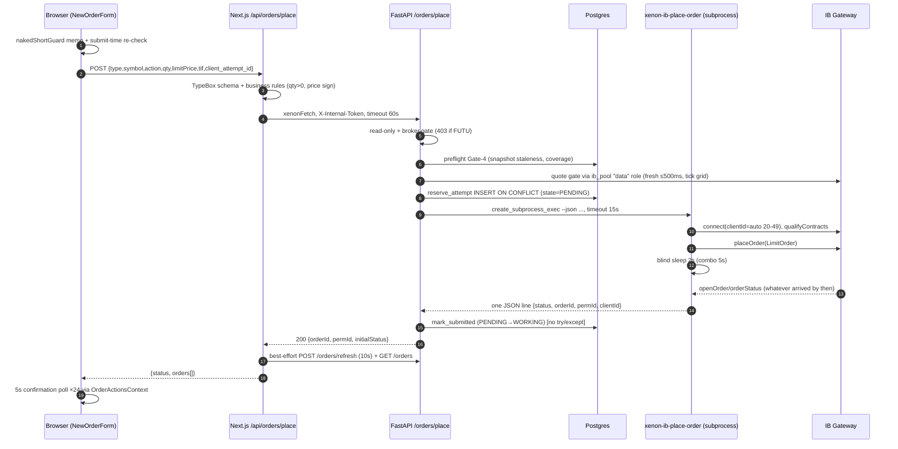
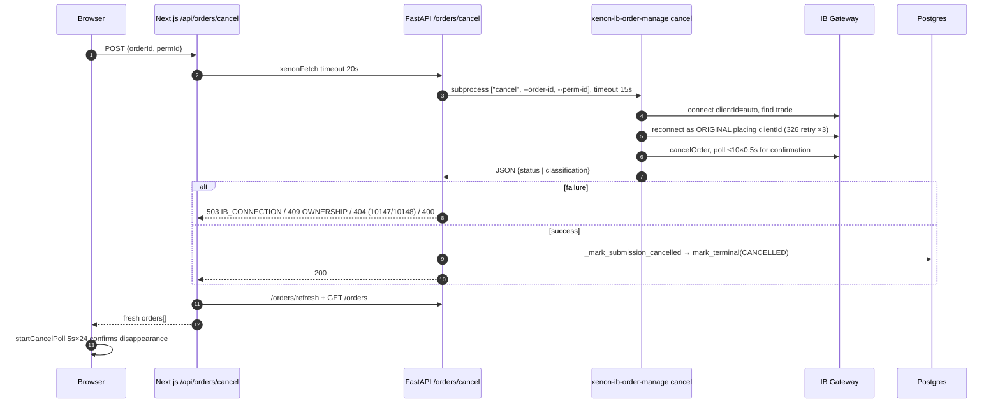
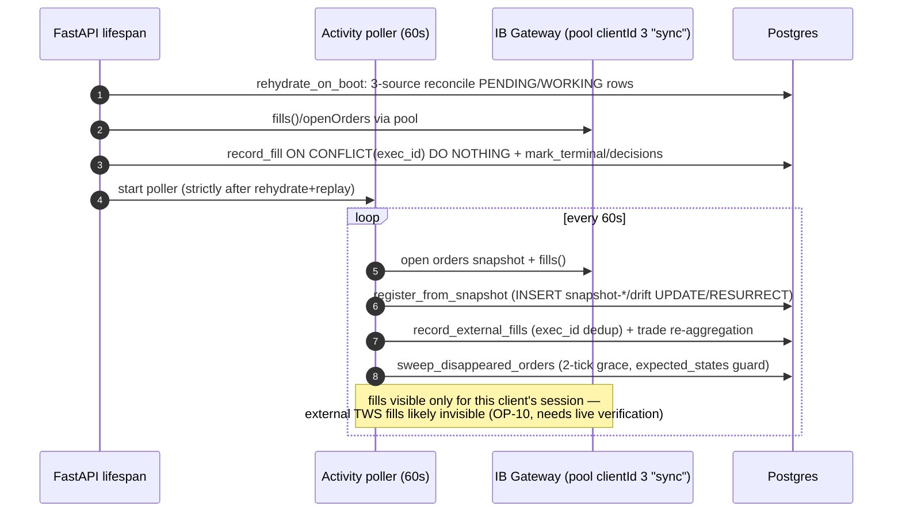
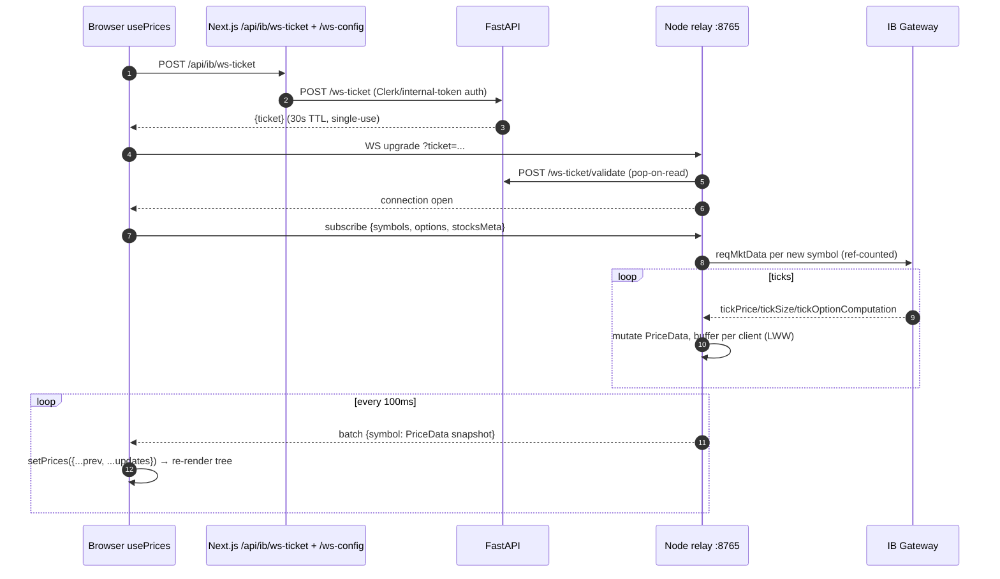

# 2. Current-State Architecture

All statements below were verified against code at commit `4d864294` unless marked otherwise.
Line numbers cited were re-checked during this review (the older
`docs/architecture/order-stack-end-to-end.md` line citations are shifted by ~750–900 lines
and should not be trusted — see finding CX-4).

## 2.1 Area A — Broker order placement

### Entry points

| Surface                                                                                                                                                               | File                                                                                     |
| --------------------------------------------------------------------------------------------------------------------------------------------------------------------- | ---------------------------------------------------------------------------------------- |
| Single-leg form (`NewOrderForm`)                                                                                                                                      | `web/components/ticker-detail/OrderTab.tsx:348-803`                                      |
| Combo form (`ComboOrderForm`) + wizard launcher                                                                                                                       | `OrderTab.tsx:807-1618`                                                                  |
| Existing-order row cancel/modify                                                                                                                                      | `OrderTab.tsx:252-270` → `ModifyOrderModal.tsx`                                          |
| Additional order surfaces (OptionsChainTab OrderBuilder, BookTab StockOrderForm, InstrumentDetailModal LegOrderForm, PositionOrderModal, `/orders` CancelOrderDialog) | grep-confirmed via shared component imports; not deep-read this review                   |
| Operator CLI outside the web path                                                                                                                                     | `src/xenon/execution/ib_execute.py` (564 lines, bypasses every web gate — finding OP-14) |

### Main components and process boundaries

```
Browser (React)  ── fetch ──►  Next.js API routes (proxy, node)  ── xenonFetch + X-Internal-Token ──►
FastAPI (uvicorn, :8321/:8421)  ── asyncio.create_subprocess_exec ──►  xenon-ib-place-order /
xenon-ib-order-manage (fresh Python process, fresh IB TCP session, clientId auto 20-49)  ──►
IB Gateway (:4001/:4002)                                    Postgres (order_submissions,
                                                            order_events, order_fills, trades)
```

- **Writes are subprocess-per-operation**: place (`server.py:2277`), cancel (`server.py:2431`),
  modify (`server.py:2604`) — all `timeout=15`, SIGKILL on expiry (`src/xenon/api/subprocess.py:125-132`).
- **Reads are in-process** via `ib_pool` role-pinned persistent connections
  (`sync`=3, `orders`=4, `data`=5; `src/xenon/clients/ib_client.py:88-92`): quote snapshots
  (`server.py:1942-1949`), boot rehydrate/fills replay, the 60s activity poller.
- A **pool-based cancel/modify path exists and is tested** (`xenon/api/pool_order_manage.py`,
  master-clientId semantics) but is imported and never called (`server.py:55` only) — dormant.

### Control flow — place (single-leg and combo share the route)

1. `require_mode_verified` + read-only guard (`server.py:2116-2117`)
2. Broker gate: 403 `READ_ONLY_BROKER` if `app.state.broker != "IB"` (`server.py:2140-2149`)
3. Gate-4 preflight (naked-short/coverage/universe, PG snapshot staleness) `server.py:1762-1804`
4. Quote gate — **non-combo only** (`_validate_non_combo_quote`, `server.py:2185-2202`):
   market hours, ≤500 ms quote freshness, tick grid, ±5%/2-tick limit band. Combos skip this
   gate entirely and rely on preflight `evaluate_combo` + IB's own rejection.
5. Idempotency reservation `reserve_attempt` — `INSERT … ON CONFLICT DO NOTHING`, key
   `(broker, account_env, broker_account, user_id, client_attempt_id)`
   (`orders_store.py:106-160`, `schema.py:611-618`). `user_id` is hardcoded `"local"`
   (`server.py:2213`).
6. Subprocess `xenon-ib-place-order --json <body>`: connect `client_id="auto"` (random-start
   probe in 20–49, rotate on "already in use", `ib_client.py:303-345`), qualify contract(s),
   `LimitOrder`, then a **blind `client.sleep(2)` (5 s combo)** before reading whatever
   `orderStatus` is (`ib_place_order.py:147-148`), print one JSON line, exit.
7. On success: `mark_submitted` (state→WORKING, ib ids persisted) — **no try/except**
   (`server.py:2325-2331`). On `result.ok == False` (including the 15 s timeout):
   `mark_terminal(FAILED, SUBPROCESS_ERROR)` + 502 (`server.py:2278-2286`).

### State ownership & persistence boundaries

- **Postgres is the only durable order state** (`xenon.order_submissions` update-in-place +
  `xenon.order_events` append-only + `xenon.order_fills` insert-only keyed by `exec_id` PK).
- IB Gateway holds the authoritative broker state; it is mirrored by the 60 s activity poller
  (`ib_activity_mirror.py`) and boot-time rehydrate/fills replay (`server.py:540-563`,
  strictly sequential: rehydrate → fills replay → poller start).
- The browser holds only optimistic overlays (`OrderActionsContext.tsx:98-118`) reconciled by
  5 s confirmation polling (24 ticks max) and a 30 s background `useOrders` sync.

### Concurrency model

- FastAPI event loop never touches ib_async directly for writes; pool reads are pinned to
  one worker thread per role (`ib_pool.py:120-153`) to respect ib_async's thread-affine loop.
- **No semaphore bounds concurrent order subprocesses** — 9 unguarded
  `_run_ib_script_with_recovery` call sites; the 15 s global cooldown (`server.py:3097-3143`)
  triggers only _after_ a detected connection failure.
- Duplicate same-`client_attempt_id` submissions are serialized by the DB reservation
  (proven under 6–8 concurrent threads in tests).

### Failure & recovery paths

- Boot: rehydrate three-source reconcile over `{PENDING, WORKING, PARTIALLY_FILLED}`
  (10 s budget) → fills replay (30 s) → poller. All skipped under `XENON_READ_ONLY=1`
  and test mode.
- Runtime: the poller mirrors open-order drift into `snapshot-*` rows, sweeps disappeared
  orders to CANCELLED/FILLED with a one-tick grace and an empty-snapshot guard
  (`ib_activity_mirror.py:125-287`). **No runtime sweep exists for stuck `PENDING` rows or
  for `FAILED`-but-actually-live orders** (finding OP-1/OP-3).

### Sequence — single-leg IB placement



Combo placement differs only in payload (`legs[]`), the 5 s sleep, one BAG contract built
from qualified legs, and **skipping the quote gate** (step "quote gate" absent).

### Sequence — cancel



### Sequence — modify (price/qty) and combo replace

```mermaid
sequenceDiagram
    autonumber
    participant B as Browser (ModifyOrderModal)
    participant N as Next.js /api/orders/modify
    participant F as FastAPI /orders/modify
    participant PG as Postgres
    participant SP as xenon-ib-order-manage modify
    participant IB as IB Gateway

    B->>N: POST {orderId/permId, price, qty, modify_sequence}
    alt combo leg-structure change (replace)
      N->>F: POST /orders/cancel (each target, 20s)
      N->>F: POST /orders/place (new combo, 20s)
      Note over N: NOT atomic — place failure after cancel leaves position naked (OP-6)
    else price/qty modify
      N->>F: xenonFetch /orders/modify timeout 20s
      F->>PG: apply_modify — monotonic modify_sequence gate (409 MODIFY_STALE, echoes applied)
      F->>SP: subprocess ["modify", ...], timeout 15s
      SP->>IB: reconnect as owner clientId, placeOrder(modified), poll confirm
      SP-->>F: JSON result
      Note over PG: limit_price / quantity are NEVER updated on the UUID row (OP-4)
      F-->>N: result (+ applied_sequence on failure)
    end
    N-->>B: refreshed orders; optimistic overlay + 5s poll ×24
```

### Sequence — fill reconciliation



## 2.2 Area B — Quote proxy / WebSocket service

### Topology

```
IB Gateway (:4001/:4002)
   ▲ one @stoqey/ib TCP session, clientId pool [10,11,12]
Node relay  scripts/infra/ib_realtime/ib_realtime_server.js  (WS :8765 prod / :8866 dev, + GET /status)
   ▲ browser connects DIRECTLY (not via Next.js), URL discovered via /api/ib/ws-config
   ▲ ticket validated via FastAPI POST /ws-ticket/validate (30s TTL, single-use)
Browser: usePrices (quotes/depth/tape socket) + IBStatusContext (second socket, status)
```

- Subscription set is **client-pushed** (portfolio + open-order legs + focused ticker),
  unioned in the single `usePrices` call site `WorkspaceShell.tsx:254`.
- Relay reference-counts client↔symbol (`symbolSubscribers`/`clientSymbols`,
  relay `:492-493`), cancels the IB ticket on last-subscriber-out (`:906-927`).
- Batching: 100 ms last-write-wins per client per symbol (`BATCH_INTERVAL_MS=100`, `:703`;
  early flush at 50 buffered symbols). Full shallow copy per buffered entry — no intra-message
  tearing, but no sequence numbers and `timestamp` = relay receive time
  (`ib_tick_handler.js:179,285`); only tape prints carry exchange time.
- **No backpressure**: `sendMessage` is bare `.send()` in try/catch (`:756-764`), JSON
  serialized per client, buffers unbounded (QS-1).
- Reconnect: relay→IB fixed 5 s retries + full resubscribe; browser→relay exponential backoff
  (1 s→30 s, 10 attempts) + full resubscribe that **churns IB tickets non-idempotently**
  (`startLiveSubscription` always cancel+re-req, `:833-862`).
- Stale watchdog: no tick 45 s during RTH → "restart gateway", which in the docker/cloud prod
  branch only bounces the relay's own socket (`:665-689`), 120 s cooldown.
- State is all in-process; a relay restart drops every subscription and price (clients rebuild).

### Sequence — live quote subscription & delivery



### Sequence — reconnect after IB Gateway interruption

```mermaid
sequenceDiagram
    autonumber
    participant R as Relay
    participant IB as IB Gateway
    participant B as Browser

    IB--xR: TCP drop / stale 45s during RTH
    R->>B: broadcastStatus ib_connected=false
    loop every 5s (fixed, unlimited)
      R->>IB: reconnect attempt (rotate clientId on 326-style reject)
    end
    IB-->>R: connected
    R->>R: wipe symbol/depth state, clear search cache
    R->>IB: reqMarketDataType(4) + re-reqMktData every subscribed symbol
    R->>B: status ib_connected=true; fresh ticks resume
    Note over B: if the WS itself dropped: exponential backoff reconnect,<br/>fresh ticket, full resubscribe (lastSentHash reset)
```

## 2.3 Futu — actual implementation (verified, not intended)

Futu order placement/cancel/modify is **ABSENT** (zero `place_order`/`unlock_trade`/`TrdSide`
usages repo-wide). What exists is a substantial **read-only** subsystem, plus a schema that
actively locks execution to IB (`CheckConstraint("broker = 'IB'")` on `order_submissions`,
`trades`, wizard tables — `schema.py:606,115,707,757`).

```mermaid
sequenceDiagram
    autonumber
    participant UI as Browser (Futu tab, 30s POST poll)
    participant N as Next.js /api/futu/portfolio
    participant F as FastAPI
    participant OD as Futu OpenD
    participant J as data/futu_portfolio.json
    participant PG as Postgres (futu_orders/trades/closed_trades/nav)

    UI->>N: POST (sync request)
    N->>F: POST /futu/sync (singleflight + 10s cooldown)
    F->>OD: position_list_query / accinfo_query
    alt degraded snapshot (fewer positions / warnings)
      F->>J: REFUSE overwrite; keep good cache + error sidecar
    else ok
      F->>J: atomic_save JSON cache (deliberate non-DB-first exception)
      F->>PG: best-effort nav_history row
    end
    F-->>UI: portfolio (staleness state machine: live/stale/never_synced/down)
    Note over F,PG: separate DB-first path: nightly 16:30 ET history loop +<br/>/futu/sync order refresh → futu_orders / futu_trades / futu_closed_trades (read mirror only)
```
