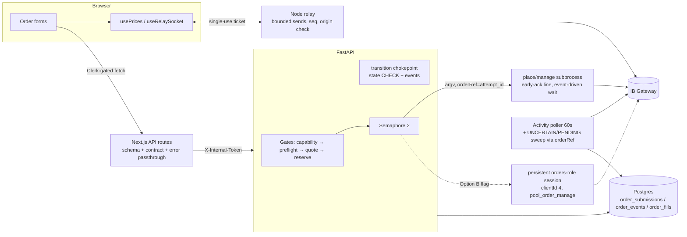
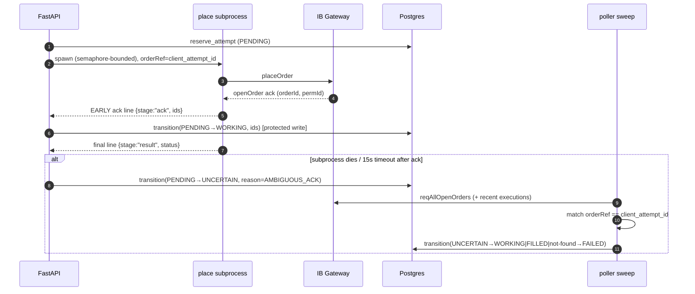

# 9. Target Architecture Options & Recommendation

## Option A — Minimal refactor (fix the ack protocol in place)

**Changed components:** `ib_place_order.py` (orderRef + early ack line + event-driven wait),
`server.py` order handlers (UNCERTAIN on ambiguity, semaphore, protected `mark_submitted`),
`orders_store.py` (`transition()` chokepoint, state CHECK, modify writes price/qty),
`ib_activity_mirror.py` (UNCERTAIN/PENDING sweep via orderRef), `naked_short_audit.py`
(state sync), Next.js order routes (Clerk check, SEC-1), relay (bounded sends, Origin
check, seq), plus dead-code deletion.

- **Benefits:** eliminates the Critical duplicate-order window; closes the auth bypass;
  keeps every operational property that currently works (fault isolation, restart safety).
- **Disadvantages:** latency floor stays ~2–4 s (blind-sleep removal helps but spawn +
  connect remain); two order CLIs still exist.
- **Migration effort:** ~10–15 focused PRs, each independently shippable and testable.
- **Operational impact:** none (no new processes).
- **Performance effect:** −2/−5 s from event-driven ack; otherwise unchanged.
- **Risks:** low; every change is behind existing tests plus the new fake-CLI tests.
- **Rollback:** per-PR revert; the UNCERTAIN state is additive (old code treats it as
  non-terminal).

## Option B — Moderate redesign (persistent execution session, D4 hybrid)

**Changed components:** promote `pool_order_manage` (already written and tested) to the
primary cancel/modify path; add a `pool_place_order` on the persistent "orders" role
(clientId 4) with event-driven acks (`openOrder`/`orderStatus` awaits, no sleep); the
subprocess CLIs remain as a degraded-mode fallback and for operator use; reconciliation
unchanged.

- **Benefits:** est. place latency 0.3–1 s; single owner clientId makes cancel/modify
  trivial (no owner-reconnect dance); in-flight visibility; natural per-session ordering.
- **Disadvantages:** ib_async loop pinning inside FastAPI is exactly the risk class this
  repo has been burned by (memory: reqTickersAsync hangs, thread-rotation bugs); a wedged
  session degrades the API process; needs watchdog + circuit-back-to-subprocess logic.
- **Migration effort:** medium; gate behind a flag, run paper-first for weeks.
- **Operational impact:** none new externally; internal watchdog required.
- **Performance effect:** the big one (if measurements say it matters).
- **Risks:** medium — order ownership semantics, session-health coupling.
- **Rollback:** flag flip back to subprocess path (kept warm by tests).

## Option C — Strategic redesign (dedicated execution worker + outbox)

FastAPI writes commands to `order_submissions` (already outbox-shaped); a separate worker
process owns broker sessions, consumes PENDING commands, drives an explicit state machine,
and pushes order events over the existing WS channel; broker-adapter Protocol introduced
here if Futu execution is approved.

- **Benefits:** clean restart semantics, strongest ordering/idempotency story, the only
  option that makes multi-broker execution non-invasive; order events pushed to UI kills
  the 5 s/30 s polling.
- **Disadvantages:** a new deployable on the macmini stack; queue-consumer liveness is now
  on the operator's pager; latency similar to B.
- **Migration effort:** high; **not justified by any observed problem at single-operator
  scale** — every defect found in this review is fixable in A/B.
- **Risks:** highest; rollback = keep FastAPI's direct path callable.

## Recommended target: **A now, B later behind measurements, C only with Futu-execution + multi-user**

Rationale: the review found exactly one Critical defect and it is a _protocol_ bug, not a
topology bug. The current topology's strengths (subprocess fault isolation, PG-first state,
sequential boot reconcile, separate relay process) are the reasons the system has survived
its incident history; discarding them to chase latency that nobody has measured would
violate the evidence. Option A closes the safety holes at near-zero operational risk;
Option B is the sanctioned path to latency once §8 numbers exist; the dormant, tested
`pool_order_manage` module means half of B is already written.

### Target component diagram (post-A, with B as dashed future)

### Target sequence — placement with ambiguity handling (post-A)

